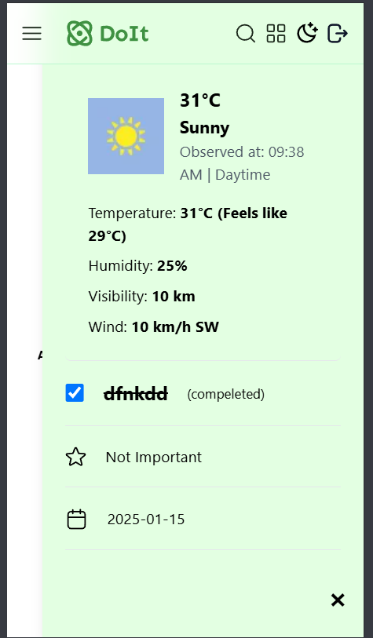

# Advanced React To-Do Application with API Integration

## Table of Contents
- [Introduction](#introduction)
- [Features](#features)
- [Technologies Used](#technologies-used)
- [Screenshots](#screenshots)

---

## Introduction
This is an advanced To-Do application built with React, Redux, and Tailwind CSS. It features API integration to fetch weather data, advanced state management with Redux, user authentication, and responsive design for an enhanced user experience.

---

## Features
1. **Task Management:**
   - Add tasks with date and Importance.
   - View and delete tasks.
   - Persistent storage using `localStorage`.

2. **User Authentication:**
   - Mock login/logout functionality.
   - Protect tasks behind authentication.

3. **API Integration:**
   - Fetch weather data using the weatherstack API for tasks related to outdoor activities.

4. **Responsive Design:**
   - Fully responsive for mobile, tablet, and desktop devices.

5. **Error Handling:**
   - Graceful handling of API errors with user-friendly messages.

---

## Screenshots
1. **Login :**
   - 
2. **Home :**
   - 
3. **Task Details with Weather conditions:**
  - 
4. **Responsive :**
  - 
  - 
  - 